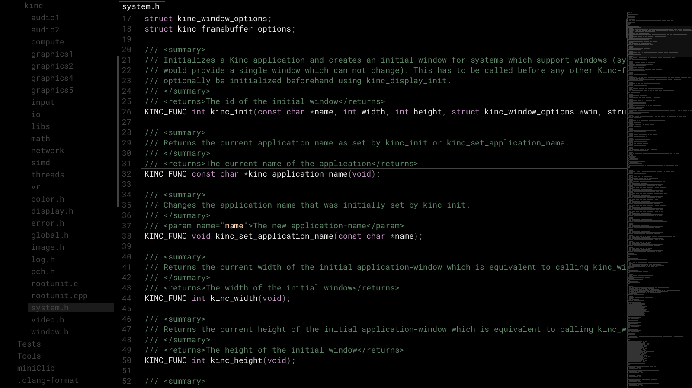

# armorpad

ArmorPad is a text editor prototype. The goal is to improve text editing & rendering capabilities in [zui](https://github.com/armory3d/zui).

*Note: If you are compiling git version of ArmorPad, then you need to have a compiler ([Visual Studio](https://visualstudio.microsoft.com/downloads/) - Windows, [clang](https://clang.llvm.org/get_started.html) + [deps](https://github.com/armory3d/armorpaint/wiki/Linux-Dependencies) - Linux, [Xcode](https://developer.apple.com/xcode/resources/) - macOS) and [git](https://git-scm.com/downloads) installed.*

```bash
git clone --recursive https://github.com/luboslenco/armorpad
cd armorpad
```

**Windows**
```bash
# Unpack `armorcore\v8\libraries\win32\release\v8_monolith.7z` using 7-Zip - Extract Here (exceeds 100MB)
armorcore\Kinc\make --from armorcore -g direct3d11
# Open generated Visual Studio project at `build\ArmorPad.sln`
# Build and run for x64 & release
# Copy build\x64\Release\ArmorPad.exe to build\krom to run ArmorPad.exe directly
```

**Linux**
```bash
armorcore/Kinc/make --from armorcore -g opengl --compiler clang --compile
cd armorcore/Deployment
./ArmorPad ../../build/krom
```

**macOS**
```bash
armorcore/Kinc/make --from armorcore -g metal
cp -a build/krom/ armorcore/Deployment
# Open generated Xcode project at `build/ArmorPad.xcodeproj`
# Build and run
```
